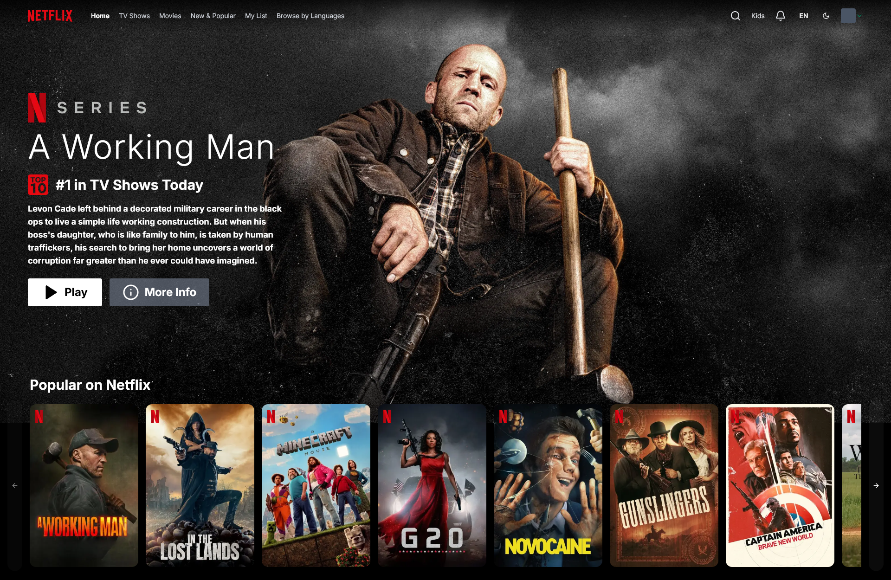

### 🏠 Homepage
  
*The screenshot above shows the Netflix-like interface of the Nextflix application, featuring a responsive design with movie categories, trending titles, and an immersive browsing experience.*

## 🎥 Live Demo

You can check out a live preview here:

- **Frontend (web)**: Deployed on [Vercel](https://nextflix-nextzy.vercel.app/)
- **Backend (api)**: Deployed on [Render](https://nextflix-xzkm.onrender.com/api/movie)

> **Note**: If the backend API is inactive, it may take up to **50 seconds** to start due to Render's free-tier limitations.

---

# 🎬 Nextflix - Netflix Clone with The Movie Database API

<p align="center">


</p>

Nextflix is a code interview project that demonstrates a Netflix-like interface using Next.js for the frontend and NestJS for the backend. The application fetches movie data from The Movie Database (TMDB) API to display movie information.

## 📋 Table of Contents

- [🎬 Nextflix - Netflix Clone with The Movie Database API](#-nextflix---netflix-clone-with-the-movie-database-api)
  - [📋 Table of Contents](#-table-of-contents)
  - [🚀 Key Features](#-key-features)
  - [🏗 System Architecture](#-system-architecture)
  - [🧰 Technologies \& Libraries](#-technologies--libraries)
    - [Frontend (web)](#frontend-web)
    - [Backend (api)](#backend-api)
  - [🛠 Prerequisites](#-prerequisites)
  - [💻 Installation](#-installation)
  - [🛠 Development](#-development)
    - [Developing Specific Parts](#developing-specific-parts)
    - [Using Swagger API](#using-swagger-api)
  - [🏗 Building](#-building)
  - [🧪 Testing](#-testing)
  - [🚀 Deployment](#-deployment)
  - [📚 Useful Links](#-useful-links)
    - [Next.js (Frontend)](#nextjs-frontend)
    - [NestJS (Backend API)](#nestjs-backend-api)
    - [The Movie Database API](#the-movie-database-api)
  - [❓ FAQ](#-faq)
  - [⚠️ Known Issues](#️-known-issues)
  - [🤝 Contributing](#-contributing)
  - [📄 License](#-license)

## 🚀 Key Features

- **Netflix-like UI**: Responsive interface mimicking Netflix's design
- **Movie Browsing**: Browse movies by categories, trending, and popular
- **Movie Details**: View detailed information about movies
- **Fast Frontend**: Built with Next.js for high performance
- **API Integration**: Backend built with NestJS to connect with TMDB API
- **TypeScript**: Type safety throughout the application
- **Swagger API Docs**: Interactive API documentation for testing during development
- **Modern UI Libraries**: Built with Tailwind CSS, shadcn/ui, and other modern libraries

## 🏗 System Architecture

Nextflix consists of two main components:

- **web** - Next.js app that serves as the Frontend for users
- **api** - NestJS app that serves as the Backend API and connects to TMDB

## 🧰 Technologies & Libraries

### Frontend (web)
- **Next.js** - React framework for production
- **React** - UI library
- **TypeScript** - Type safety
- **Tailwind CSS** - Utility-first CSS framework
- **TanStack Query** - Data fetching and state management
- **shadcn/ui** - Beautiful, accessible UI components built with Radix UI and Tailwind CSS
- **Next-themes** - Theme management
- **Next-intl** - Internationalization
- **Embla Carousel** - Carousel component
- **Lucide React** - Icon library

### Backend (api)
- **NestJS** - Progressive Node.js framework
- **Swagger** - API documentation and testing
- **Axios** - HTTP client
- **Class Validator** - Input validation
- **Helmet** - Security middleware
- **Joi** - Schema validation

## 🛠 Prerequisites

- Node.js >= 16.x
- npm >= 8.x
- Turborepo (optional, for monorepo management)

## 💻 Installation

1. Clone the project:

```bash
git clone https://github.com/Piamsit/nextzy-nextflix.git
cd nextflix
```

2. Install dependencies:

```bash
npm install
```

3. Set up environment variables:
   - Register for an API key at [The Movie Database](https://www.themoviedb.org/documentation/api)
   - Create a `.env` file in both the `apps/api` and `apps/web` directories
   - Add the required environment variables to the `.env` files:

   **For `apps/web/.env.local`:**
   ```
   # TMDB API Configuration
   NEXT_PUBLIC_API_URL=http://localhost:3001
   ```

   **For `apps/api/.env.local`:**
   ```
   # TMDB API Configuration
   TMDB_API_KEY=your_api_key_here
   TMDB_API_URL=https://api.themoviedb.org/3
   
   # Application Configuration
   PORT=3001
   
   # CORS Configuration
   FRONTEND_ORIGIN=http://localhost:3000
   ```

## 🛠 Development

To develop all apps simultaneously, run one of these commands:

```bash
# Using npm
npm run dev

# Using Turborepo
turbo dev
```

After running either command:

- Frontend will run at [http://localhost:3000](http://localhost:3000)
- Backend API will run at [http://localhost:3001](http://localhost:3001)

### Developing Specific Parts

If you want to develop only a specific part:

```bash
# Using npm
# Develop only Frontend
npm run dev --workspace=web

# Develop only Backend API
npm run dev --workspace=api

# Using Turborepo
# Develop only Frontend
turbo dev --filter=web

# Develop only Backend API
turbo dev --filter=api
```

### Using Swagger API

During development, you can use Swagger UI to test and explore the API endpoints:

1. Start the backend API server:
   ```bash
   npm run dev --workspace=api
   # or
   turbo dev --filter=api
   ```

2. Open your browser and navigate to:
   ```
   http://localhost:3001/api
   ```

3. The Swagger UI interface will allow you to:
   - View all available API endpoints
   - Test API calls directly from the browser
   - See request/response schemas
   - Execute API requests and view responses

## 🏗 Building

To build all apps, run this command:

```bash
npm run build
```

## 🧪 Testing

```bash
# Using npm
# Test everything
npm test

# Test only Frontend
npm test --workspace=web

# Test only Backend API
npm test --workspace=api

# Using Turborepo
# Test everything
turbo test

# Test only Frontend
turbo test --filter=web

# Test only Backend API
turbo test --filter=api

# Run E2E tests
turbo test:e2e
```

## 🚀 Deployment

To deploy Nextflix to production:

1. Build the application:
   ```bash
   npm run build
   ```

2. Deploy the frontend (Next.js app):
   - Deploy to Vercel
   - Or deploy to any static hosting service

3. Deploy the backend (NestJS API):
   - Deploy to a Node.js hosting service like Heroku, Railway, or Render
   - Set up the required environment variables

## 📚 Useful Links

### Next.js (Frontend)

- [Next.js Documentation](https://nextjs.org/docs)
- [Learn Next.js](https://nextjs.org/learn)

### NestJS (Backend API)

- [NestJS Documentation](https://docs.nestjs.com)

### The Movie Database API

- [TMDB API Documentation](https://developers.themoviedb.org/3/getting-started/introduction)
- [TMDB API Reference](https://developers.themoviedb.org/3/movies/get-movie-details)

## ❓ FAQ

**Q: How do I get a TMDB API key?**  
A: You can register for a free API key at [TMDB API](https://www.themoviedb.org/documentation/api).

**Q: Can I deploy this project on a different platform?**  
A: Yes, you can deploy the frontend on any static hosting service and the backend on any Node.js hosting service.

## ⚠️ Known Issues

- The application does not support offline mode.
- API rate limits may affect performance if too many requests are made.

## 🤝 Contributing

Contributions are welcome! Please feel free to submit a Pull Request.

1. Fork the repository
2. Create your feature branch (`git checkout -b feature/amazing-feature`)
3. Commit your changes (`git commit -m 'Add some amazing feature'`)
4. Push to the branch (`git push origin feature/amazing-feature`)
5. Open a Pull Request

## 📄 License

This project is licensed under the MIT License - see the [MIT License on OpenSource.org](https://opensource.org/licenses/MIT) for details.
